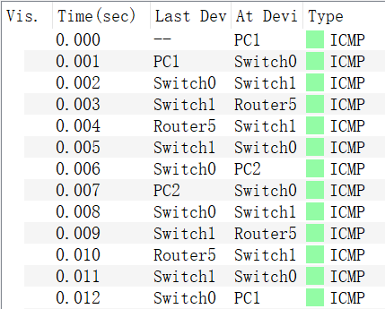
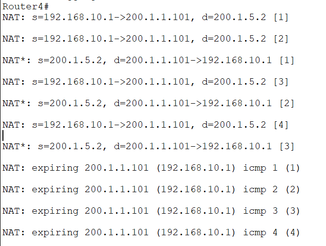
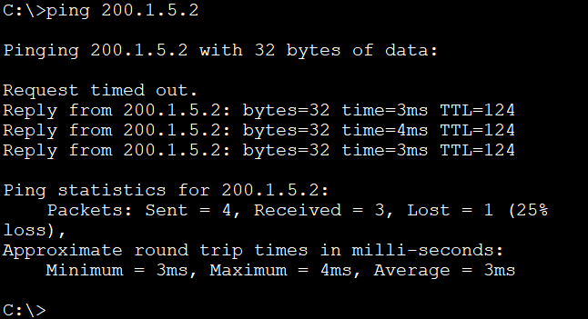
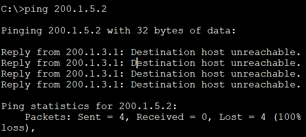
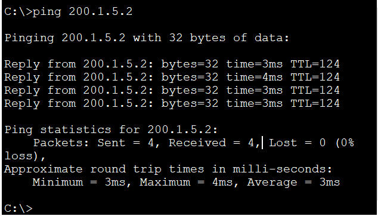

## 基本配置（VLAN，RIP）

**配置VLAN以及所有路由器、PC的IP地址，并配置动态RIP**

Switch0

```
//将Switch0和Switch1之间的链路设置为trunk链路
Switch(config)#hostname Switch0
Switch0(config)#interface FastEthernet0/23
Switch0(config-if)#switchport mode trunk


Switch0(config)#vlan 10


Switch0(config)#interface FastEthernet0/1
Switch0(config-if)#switchport mode access
Switch0(config-if)#switchport access vlan 10
Switch0(config-if)#exit
Switch0(config)#interface FastEthernet0/2
Switch0(config-if)#switchport mode access
Switch0(config-if)#switchport access vlan 20
```

Switch1

```
//将Switch0和Switch1之间的链路设置为trunk链路
Switch(config)#hostname Switch1
Switch1(config)#interface FastEthernet0/23
Switch1(config-if)#switchport mode trunk


Switch1(config)#vlan 20


Switch1(config)#interface FastEthernet0/1
Switch1(config-if)#switchport mode access
Switch1(config-if)#switchport access vlan 10
Switch1(config-if)#exit
Switch1(config)#interface FastEthernet0/2
Switch1(config-if)#switchport mode access 
Switch1(config-if)#switchport access vlan 20


Switch1(config)#interface FastEthernet0/24
Switch1(config-if)#switchport mode trunk 
```

Router1

```
Router1(config)#interface FastEthernet0/0
Router1(config-if)#ip address 200.1.5.1 255.255.255.0
Router1(config-if)#no shutdown

Router1(config)#interface Serial0/0/0
Router1(config-if)#ip address 200.1.4.1 255.255.255.0
Router1(config-if)#no shutdown

Router1(config)#interface Serial0/0/1
Router1(config-if)#ip address 200.1.3.1 255.255.255.0
Router1(config-if)#no shutdown


Router1(config)#router rip
Router1(config-router)#network 200.1.3.0
Router1(config-router)#network 200.1.4.0
Router1(config-router)#network 200.1.5.0
```

Router2

```
Router2(config)#interface Serial0/0/0
Router2(config-if)#ip address 200.1.1.2 255.255.255.0
Router2(config-if)#no shutdown

Router2(config)#interface Serial0/0/1
Router2(config-if)#ip address 200.1.3.2 255.255.255.0
Router2(config-if)#no shutdown

Router2(config)#interface FastEthernet0/0
Router2(config-if)#ip address 200.1.2.2 255.255.255.0
Router2(config-if)#no shutdown


Router2(config)#router rip
Router2(config-router)#network 200.1.1.0
Router2(config-router)#network 200.1.2.0
Router2(config-router)#network 200.1.3.0
```

Router3

```
Router3(config)#interface FastEthernet0/0
Router3(config-if)#ip address 200.1.2.1 255.255.255.0
Router3(config-if)#no shutdown

Router3(config)#interface Serial0/0/0
Router3(config-if)#ip address 200.1.4.2 255.255.255.0
Router3(config-if)#no shutdown


Router3(config)#router rip
Router3(config-router)#network 200.1.2.0
Router3(config-router)#network 200.1.4.0
```

Router4

```
Router4(config)#interface Serial0/0/0
Router4(config-if)#ip address 192.168.30.2 255.255.255.0
Router4(config-if)#no shutdown

Router4(config)#interface Serial0/0/1
Router4(config-if)#ip address 200.1.1.1 255.255.255.0
Router4(config-if)#no shutdown


Router4(config)#router rip
Router4(config-router)#network 192.168.30.0
Router4(config-router)#network 200.1.1.0
```

Router5

```
Router5(config)#interface FastEthernet0/0
Router5(config-if)#no ip address
Router5(config-if)#no shutdown

Router5(config-if)#int f0/0.10
Router5(config-subif)#encapsulation dot1Q 10
Router5(config-subif)#ip address 192.168.10.3 255.255.255.0
Router5(config-subif)#exit

Router5(config)#int f0/0.20
Router5(config-subif)#encapsulation dot1Q 20
Router5(config-subif)#ip address 192.168.20.3 255.255.255.0

Router5(config)#interface Serial0/0/1
Router5(config-if)#ip address 192.168.30.1 255.255.255.0
Router5(config-if)#no shutdown


Router5(config)#router rip
Router5(config-router)#network 192.168.10.0
Router5(config-router)#network 192.168.20.0
Router5(config-router)#network 192.168.30.0
```

**配置完之后理论上所有设备可以互ping**

## 配置NAT（Router4）

Router4

配置NAT

```
Router4(config)#ip nat inside source static 192.168.10.1 200.1.1.101
Router4(config)#ip nat inside source static 192.168.10.2 200.1.1.102
Router4(config)#ip nat inside source static 192.168.20.1 200.1.1.201
Router4(config)#ip nat inside source static 192.168.20.2 200.1.1.202

Router4(config)#interface Serial0/0/0
Router4(config-if)#ip nat inside
Router4(config-if)#exit
Router4(config)#interface Serial0/0/1
Router4(config-if)#ip nat outside 
Router4(config-if)#end
Router4#debug ip nat
IP NAT debugging is on
```

**从PC1（192.168.10.1）,PC2,PC3,PC4分别ping PC5（200.1.5.2），结果如下图（只有PC1，其他一样），此时理论上都可以ping通，而且地址转换正确**





## 配置ACL（Router1，Router3）

**在Router1上使用标准ACL禁止PC1（192.168.10.1）对PC5的ping命令**

**未配置前PC1可以ping通PC5**



Router1

```
Router1(config)#access-list 1 deny host 200.1.1.101
Router1(config)#access-list 1 permit any
Router1(config)#interface FastEthernet0/0
Router1(config-if)#ip access-group 1 out

```

**然后在PC1上ping PC5已经是unreachable**




>  下面的操作或许不需要？

**在Router3上配置ACL是为了验证动态RIP根据跳数选择最优路径，PC2对PC5的ping命令不经过Router3**

```
Router3(config)#access-list 1 deny host 200.1.1.201
Router3(config)#access-list 1 permit any
Router3(config)#interface Serial0/0/0
Router3(config-if)#ip access-group 1 out

```

**可以看到依然可以ping通，因为PC2 ping PC5 不经过Router3**




